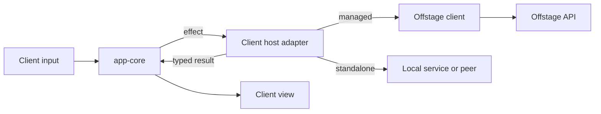

# Shared host integrations

A client host depends on both app-core and the selected host-tools packages.
App-core produces effects and view models. The host adapter executes each effect
and returns its result through the matching continuation.

## Package dependencies

`idle-protocol` is an independent contract crate. It depends on Serde, with an
optional schema exporter, and contains no network, credential, cloud, engine or
Crux implementation. App-core, Evo, Offstage and service clients consume it
without pulling in native collection or the TypeScript coordinator.

`idle-history` owns the portable source/history contracts needed by both import
adapters and app-core. Keeping it here prevents the native tools from depending
back on the application reducer. `idle-peer-state` exposes its existing pure
connection helpers to Node; app-core continues to own the client model and
subscription effects.

Native packages depend on these contracts and EditChain. EditChain knows only
its own schema, storage, indexes, queries, replication and tooling. It has no
application or host-tools dependency.

VS Code owns editor observation capture, its platform event adapter, webviews,
credential storage, trust checks and native editor actions. Its recorded editor
schema and IDs remain unchanged. Another editor supplies its own observations
and recorder identity. A management TUI can read history and issue commands
without an editor recorder.

`idle-coordination` supplies the native Rust authority, peer coordinator and
framed service. Hosts inject authentication, credentials, persistence and relay
transport. The production relay adapter uses Microsoft's Rust Dev Tunnels SDK
for management, host and client connections. Peer-v5 authentication, inventory
and replication remain in EditChain; lifecycle state comes from `idle-history`.
The existing TypeScript coordinator remains available for current hosts and is
tested against the Rust coordinator. Native consumers require neither Node nor
app-core. See [native coordination](coordination.md) for ownership and upgrades.

One authority serializes repository metadata, independent resource grants and
controller leases. History replicas do not elect competing metadata authorities.
An embedding host authenticates each principal outside the request body and
routes repository commands to that authority. Evo's live grant/lease integration
is the separate f15/f17 step; metadata success never asserts runtime acceptance.

## Offstage client boundary

The public Offstage client belongs here as an independent `idle-offstage-client`
crate when production endpoints are implemented. Its inputs and outputs use
`idle-protocol`; callers need no Crux runtime. It will own endpoint binding,
encoding, response/error decoding and event transport, with injected credentials
and transport. Native and browser transports must be separate from shared API
semantics.

The client effect adapter maps app-core operations to those calls. App-core owns
pending actions, request identity, application recovery and stale-result
handling. Sending a request must preserve its retry key. A backend receipt does
not imply runtime acceptance, execution order or completion.

The platform supplies login interaction and credential storage. Browsers can
call Offstage directly through their transport; local collection runs on the
machine containing the source files. Offstage remains responsible for server
validation, authorization and managed persistence.

The backend currently has no production API routes for this client to call.
This restructuring establishes the owner and dependencies; it does not add
placeholder endpoints or report managed capabilities as available. Existing
f47 session-directory work and other managed backend features remain pending.
