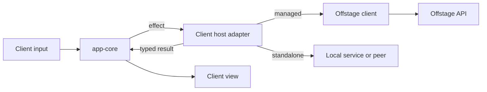

# Shared host integrations

A client host depends on both app-core and the selected host-tools packages.
App-core produces effects and view models. The host adapter executes each effect
and returns its result through the matching continuation.

## Package dependencies

`idle-protocol` is an independent contract crate. It depends on Serde, with an
optional schema exporter, and contains no network, credential, cloud, engine or
Crux implementation. App-core, Evo, Offstage and service clients consume it
without pulling in native collection or coordination services.

`idle-history` owns the portable source/history contracts needed by both import
adapters and app-core. Keeping it here prevents the native tools from depending
back on the application reducer. App-core and native coordination use its pure
connection helpers directly; app-core owns the client model and subscription
effects.

Native packages depend on these contracts and EditChain. EditChain knows only
its own schema, storage, indexes, queries, replication and tooling. It has no
application or host-tools dependency.

`idle-editor-capture` owns the shared editor wire contract, validation, schema
conversion and durable writer. `idle-history-native` owns native history reads,
exact content previews and author/exposure projections. Both services build
without app-core or VS Code. `idle-history` provides their portable request and
result contracts; app-core retains Crux operations, application result adapters
and peer-awareness view state.

`idle-host-io` supplies bounded little-endian framing to capture, collection,
repository and history services. Each service retains its own request/response
shape and size limits. The blocking and async adapters use the same length
validation. Standalone coordination retains its separate big-endian protocol.
`idle-host` wraps unchanged service payloads in one versioned channel protocol
over a shared private pipe. Its workers link these libraries directly; they do
not launch the standalone services. Each channel owns its binding, cancellation
and credentials. See [native host](native-host.md).

The engine and application CLIs share `editchain-cli-support` for input limits,
stream formatting and basic exit codes. Application import errors and engine
query abbreviations stay with their respective commands.

VS Code owns editor event observation, webviews, credential storage, trust checks
and native editor actions. Its only Rust crate is `idle-vscode-webview`, which
mounts app-core/web-ui and implements their webview bridge. Its TypeScript host
calls the services through one packaged `idle-host`. Recorded editor schema
and IDs remain unchanged. Another editor supplies its own observations
and recorder identity. A management TUI can read history and issue commands
without an editor recorder.

`idle-coordination` supplies the native Rust authority, peer coordinator and
framed service. Hosts inject authentication, credentials, persistence and relay
transport. The production relay adapter uses Microsoft's Rust Dev Tunnels SDK
for management, host and client connections. Peer-v5 authentication, inventory
and replication remain in EditChain; lifecycle state comes from `idle-history`.
The TypeScript native peer bridge and invitation parser support older-peer
interoperability checks. Current VS Code sharing uses the Rust service.
Native consumers require neither Node nor app-core. See
[native coordination](coordination.md) for ownership and upgrades.

One authority serializes repository metadata, independent resource grants and
controller leases. History replicas do not elect competing metadata authorities.
An embedding host authenticates each principal outside the request body and
routes repository commands to that authority. Evo's live grant/lease integration
is the separate f15/f17 step; metadata success never asserts runtime acceptance.

## Offstage client boundary

The public Offstage client belongs here as an independent `idle-offstage-client`
crate when production endpoints are implemented. Its inputs and outputs use
`idle-protocol`; callers need no Crux runtime. It will own endpoint binding,
encoding, response/error decoding and event transport, with injected credentials
and transport. Native and browser transports must be separate from shared API
semantics.

The client effect adapter maps app-core operations to those calls. App-core owns
pending actions, request identity, application recovery and stale-result
handling. Sending a request must preserve its retry key. A backend receipt does
not imply runtime acceptance, execution order or completion.

The platform supplies login interaction and credential storage. Browsers can
call Offstage directly through their transport; local collection runs on the
machine containing the source files. Offstage remains responsible for server
validation, authorization and managed persistence.

The backend currently has no production API routes for this client to call.
This restructuring establishes the owner and dependencies; it does not add
placeholder endpoints or report managed capabilities as available. Existing
f47 session-directory work and other managed backend features remain pending.

## Indexed Activity timeline

`idle-history::timeline` defines version 2 of the native Activity window contract.
`QueryAction::Timeline` supports latest windows, exact occurrence seeking,
bidirectional paging, group members, indexed literal Find, refresh, resumable
build advancement and cancellation. Cursors name both a complete snapshot
revision and the filter/disclosure view. Expired cursors return `Stale`.

`idle-history-native::timeline` persists rebuildable pages under
`activity-timeline-v1`. Accepted engine revisions and the incremental change log
cover additions, conflict retractions and newly available content. A staged
snapshot updates affected records and relationships before publishing its root
atomically. Source index handles are released after every request. Native windows
include coalesced lane coverage and bends, including relationships whose two
endpoints are outside the returned window.

Projection preserves occurrence identity separately from logical-item identity.
Explicit ownership and old-address mappings combine raw inputs with normalized
outputs. Source metadata retains generation, extent, activation and lifecycle
fields. Exact raw hashes and complete recorded sequence extents are checked;
prefix digests are retained and compared for contradictions, without claiming a
second full-prefix digest computation. Missing or ambiguous relationships stay
unresolved. Retained archives must be explicitly bound. A changed archive
invalidates its derived snapshot while the last complete window stays readable.

Legacy imports keep their physical addresses while reconstructing verified
logical revisions. Supporting observation markers and importer metadata do not
become extra activities. First-incarnation clocks retain causal placement;
selected revisions supply displayed dates and native open targets. Task captions
come from the first eligible recorded prompt, with status accepted only from the
importer's verified turn slot.

Recorded turns and attempts define task boundaries. Only safe connected paths
are folded, with at most 128 members per group to bound incremental repair.
Forks, joins, Git attachments, file activities and protected outcomes remain
individually readable. A group retains all exact constituent addresses plus its
entry, exit and representative operation. Git identities include the repository,
so the same object hash in another repository cannot supply an attachment.

The default window size is 200 and the maximum is 500. Native ranks support
window and seek reads without replaying history. Filter views and Find results
are cached natively; a new literal search verifies candidates from its most
selective text posting list. Window replies carry compact summaries. App-core
retains at most 2,000 summaries and 32 MiB across the full editor and sidebar;
complete content remains a separate native request.

`OpenAt` distinguishes an exact current/retained record from a repository-qualified
Git commit. Live Git history comes from the trusted installed repository binding
without appending engine records; commit opens recheck that binding and full OID.
`OperationJson` decodes that selected stored representation and formats it as a
read-only `.json` document. The encoded-record action remains unchanged. The
history service answers `{ "capabilities": true }` with timeline version 2 and
`operation_json: true` before consumers activate the new timeline.

Structural tests live in `idle-history-native/src/timeline/tests`. The
`activity-fixture` example exports real native windows for web-ui's editor and
mini fixtures. The `activity-benchmark` example builds and queries synthetic
10,000-, 100,000- and 1,000,000-operation recordings with up to 100 branches.
Measure cold construction separately from warm windows, seeks and appends; retain
runner CPU/memory limits and peak process memory alongside the result JSON.
